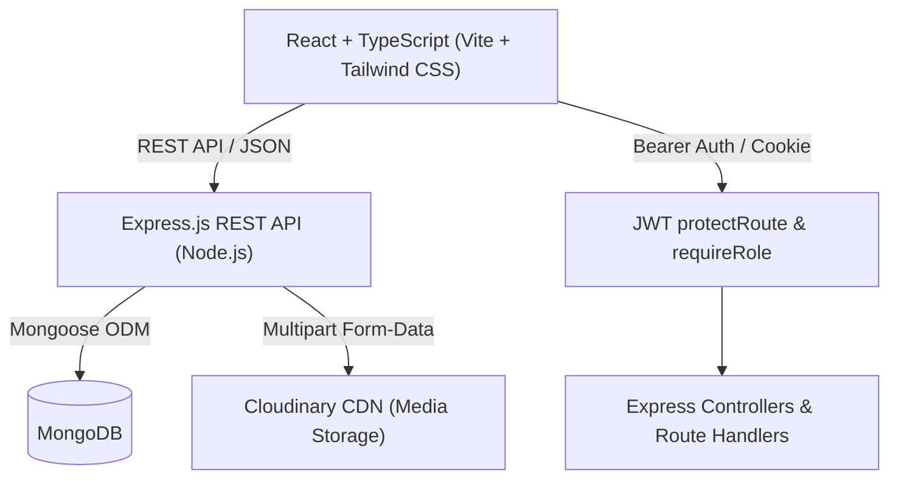
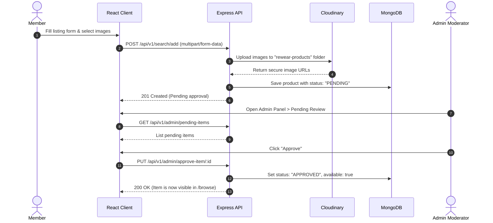
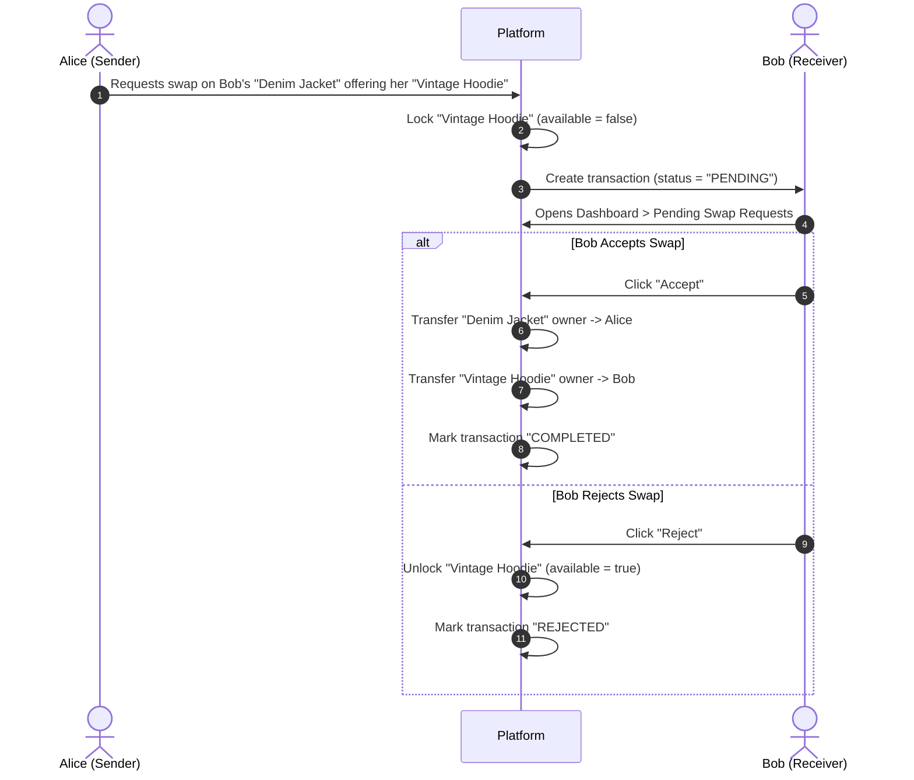

# 🌿 ReWear — Community Clothing Exchange & Sustainable Fashion Platform

[](file:///Users/sidharthasubudhi/Desktop/ODoo/odoofe)
[](file:///Users/sidharthasubudhi/Desktop/ODoo/Rewear-be)
[](file:///Users/sidharthasubudhi/Desktop/ODoo/Rewear-be)
[](file:///Users/sidharthasubudhi/Desktop/ODoo/odoofe)
[](file:///Users/sidharthasubudhi/Desktop/ODoo/LICENSE)

**ReWear** is a full-stack, community-driven circular fashion exchange designed to reduce textile waste and make sustainable fashion accessible. Members can list pre-loved garments, trade clothes directly through item-for-item swaps, or earn and redeem community points to refresh their wardrobe without spending money.

---

## 📑 Table of Contents

- [Features](#-features)
- [Architecture & Tech Stack](#-architecture--tech-stack)
- [Project Directory Structure](#-project-directory-structure)
- [System Workflows](#-system-workflows)
- [API Reference](#-api-reference)
- [Database Models](#-database-models)
- [Getting Started](#-getting-started)
  - [Prerequisites](#prerequisites)
  - [Backend Setup](#backend-setup)
  - [Frontend Setup](#frontend-setup)
  - [Creating an Administrator](#creating-an-administrator)
- [Environment Variables](#-environment-variables)
- [Testing & Quality Assurance](#-testing--quality-assurance)
- [Contributing & License](#-contributing--license)

---

## 🌟 Features

### 👤 Authentication & Role-Based Access Control
- Secure signup and login with hashed passwords via `bcryptjs`.
- Dual token validation supporting both **HTTP-only Cookies** and **Authorization: Bearer** headers for resilient cross-environment session handling.
- Onboarding welcome bonus: New accounts receive **100 bonus points** to immediately participate.
- Role-gated capabilities distinguishing standard `USER` members from platform `ADMIN` moderators.

### 🛍️ Smart Browsing & Discovery
- **Live Search & Filter**: Real-time keyword search across titles, descriptions, and tags.
- **Categorization**: Filter garments by categories (*Tops, Bottoms, Outerwear, Dresses, Shoes, Accessories, Activewear, Formal*).
- **Condition Grading**: Filter items by condition (*Like New, Excellent, Good, Fair*).
- **Dynamic Sorting**: Sort listings by newest arrivals, points (low-to-high), points (high-to-low), or oldest.
- **Dynamic Related Items**: Contextual garment suggestions on detail pages based on category matches.

### 🔄 Dual Exchange Mechanics
1. **Direct Item-for-Item Swap**:
   - Users browse another member's item and open an intuitive **Swap Modal** to select one of their own active listings to offer.
   - **Atomic Concurrency Locking**: The offered garment is locked immediately to prevent double-swaps or simultaneous redemptions.
   - The recipient can review, accept, or reject incoming swap proposals from their dashboard. Acceptance immediately transfers ownership of both pieces.
2. **Points-Based Redemption**:
   - Members can redeem available garments using their earned points.
   - Atomic concurrency checks verify user balance and decrement points while locking the garment to prevent race conditions.

### 📊 Member Dashboard
- Summary stat cards displaying **Available Points**, **Listed Items**, **Pending Swaps**, and **Account Role**.
- Listed garments manager with live status badges (`APPROVED`, `PENDING`, `REJECTED`, `Available` / `Unavailable`).
- Direct action buttons to preview item details or delete listings.
- Incoming swap request manager with one-click **Accept** and **Reject** controls that update inventory in real-time.

### 🛡️ Administration Panel (`ADMIN` only)
- **Moderation Queue**: Review submitted items pending approval before they appear publicly.
- **Active Listings Management**: Monitor live garments with ability to forcibly unlist inappropriate items.
- **Comprehensive Audit Log**: Full transaction history log tracking all swap and redemption operations.
- **Staff Delegation**: Email-based user search to grant or revoke platform `ADMIN` privileges.

---

## 🛠 Architecture & Tech Stack



### Frontend (`odoofe`)
- **Framework**: [React 18](https://react.dev/) + [TypeScript](https://www.typescriptlang.org/)
- **Bundler**: [Vite 5](https://vitejs.dev/)
- **Routing**: [React Router DOM v6](https://reactrouter.com/)
- **Styling**: [Tailwind CSS 3](https://tailwindcss.com/)
- **Icons**: [Lucide React](https://lucide.dev/)
- **State Management**: React Context API (`AuthContext`)

### Backend (`Rewear-be`)
- **Runtime**: [Node.js](https://nodejs.org/) (ES Modules)
- **Framework**: [Express 5](https://expressjs.com/)
- **Database**: [MongoDB](https://www.mongodb.com/) via [Mongoose 8](https://mongoosejs.com/)
- **Authentication**: [JSON Web Tokens (jsonwebtoken)](https://jwt.io/) & [bcryptjs](https://www.npmjs.com/package/bcryptjs)
- **Asset Storage**: [Multer](https://github.com/expressjs/multer) & [Cloudinary](https://cloudinary.com/) (`multer-storage-cloudinary`)
- **Security & Utilities**: `cookie-parser`, `cors`, `dotenv`

---

## 📂 Project Directory Structure

```text
ODoo/
├── .gitignore                      # Monorepo-level ignore rules
├── README.md                       # Comprehensive documentation
├── Rewear-be/                      # Backend Service (Node.js / Express)
│   ├── config/
│   │   ├── cloudinary.js           # Cloudinary configuration & storage engine
│   │   ├── db.js                   # Mongoose MongoDB connection handler
│   │   └── envVars.js              # Centralized environment variable loader
│   ├── controllers/
│   │   └── auth.controller.js      # User registration, login, logout, & authCheck
│   ├── middleware/
│   │   ├── protectRoute.js         # JWT cookie & Bearer token verification
│   │   ├── requireRole.js          # Role-based authorization gatekeeper
│   │   └── upload.js               # Multer-Cloudinary image upload middleware
│   ├── models/
│   │   ├── products.model.js       # Product schema (images, status, owner, etc.)
│   │   ├── transaction.model.js    # Swap & Redemption transaction schema
│   │   └── user.model.js           # User schema (roles, points, searchHistory)
│   ├── route/
│   │   ├── admin.route.js          # Admin moderation, stats, & user role routes
│   │   ├── auth.route.js           # Auth routes (/signup, /login, /logout, /authCheck)
│   │   ├── search.route.js         # Product browsing, filtering, adding, & deletion
│   │   └── transaction.route.js    # Swap proposals, acceptance, rejection, & redemptions
│   ├── make-admin.js               # CLI utility to promote users to ADMIN
│   ├── package.json
│   └── server.js                   # Express server entry point & middleware pipeline
│
└── odoofe/                         # Frontend Application (React + Vite + TypeScript)
    ├── public/                     # Public static assets
    ├── src/
    │   ├── components/
    │   │   ├── layout/
    │   │   │   ├── Footer.tsx      # Platform footer component
    │   │   │   └── Header.tsx      # Navigation header with auth controls & badge
    │   │   └── ui/
    │   │       ├── Badge.tsx       # Reusable status badge component
    │   │       ├── Button.tsx      # Reusable styled button with loading state
    │   │       ├── Card.tsx        # Styled card container
    │   │       └── Input.tsx       # Form input with validation error display
    │   ├── context/
    │   │   └── AuthContext.tsx     # Global authentication provider & session hooks
    │   ├── pages/
    │   │   ├── AddItemPage.tsx     # Garment listing form with multi-image upload
    │   │   ├── AdminPanelPage.tsx  # Admin dashboard (moderation, logs, permissions)
    │   │   ├── BrowsePage.tsx      # Catalog browsing with search, filter, and sorting
    │   │   ├── DashboardPage.tsx   # Member dashboard (listings, swaps, points)
    │   │   ├── ItemDetailPage.tsx  # Single garment view with swap modal & redeem
    │   │   ├── LandingPage.tsx     # Homepage with hero, stats, and featured items
    │   │   ├── LoginPage.tsx       # Member login form
    │   │   └── SignupPage.tsx      # Registration form
    │   ├── App.tsx                 # Route configuration
    │   ├── index.css               # Tailwind directives & global styling
    │   └── main.tsx                # React DOM root entry
    ├── package.json
    ├── tailwind.config.js
    ├── tsconfig.json
    └── vite.config.ts
```

---

## 🔄 System Workflows

### 1. Garment Submission & Moderation Lifecycle


### 2. Direct Item-for-Item Swap Lifecycle


---

## 📡 API Reference

### Health
| Method | Endpoint | Access | Description |
|---|---|---|---|
| `GET` | `/api/health` | Public | Service health and uptime check |

### Authentication (`/api/v1/auth`)
| Method | Endpoint | Access | Description |
|---|---|---|---|
| `POST` | `/signup` | Public | Register new user; awards 100 welcome points |
| `POST` | `/login` | Public | Authenticate user; returns token & user payload |
| `POST` | `/logout` | Authenticated | Clears auth cookie & invalidates session |
| `GET` | `/authCheck` | Authenticated | Validates session & returns current user profile |

### Garments & Search (`/api/v1/search`)
| Method | Endpoint | Access | Query / Body Params | Description |
|---|---|---|---|---|
| `POST` | `/add` | Authenticated | Form-data: `title`, `description`, `category`, `size`, `condition`, `points`, `tags`, `images` (up to 5) | Submit new garment for approval |
| `GET` | `/all` | Public | `?search=...&category=...&condition=...&sort=...` | Browse approved, available garments |
| `GET` | `/my-items` | Authenticated | None | Retrieve authenticated user's listed garments |
| `DELETE` | `/item/:id` | Authenticated (Owner) | None | Remove a listing owned by the current user |
| `GET` | `/related/:id` | Public | None | Retrieve up to 3 related items in same category |
| `GET` | `/:id` | Public | None | Fetch single garment details by MongoDB ObjectId |

### Transactions (`/api/v1/transaction`)
| Method | Endpoint | Access | Body Params | Description |
|---|---|---|---|---|
| `POST` | `/redeem/:itemId` | Authenticated | None | Redeem item with user points |
| `POST` | `/swap/request` | Authenticated | `{ targetItemId, offeredItemId }` | Send swap proposal to item owner |
| `POST` | `/swap/:id/accept` | Authenticated (Receiver) | None | Accept pending swap & exchange ownership |
| `POST` | `/swap/:id/reject` | Authenticated (Receiver/Sender) | None | Reject or cancel pending swap request |
| `GET` | `/my-swaps` | Authenticated | None | List pending swap requests received by user |
| `GET` | `/my-sent-swaps` | Authenticated | None | List swap requests initiated by user |
| `GET` | `/all` | Admin Only | None | View platform-wide transaction audit log |

### Administration (`/api/v1/admin`)
| Method | Endpoint | Access | Description |
|---|---|---|---|
| `GET` | `/stats` | Admin Only | Platform metrics (pending count, active count, users, transactions) |
| `GET` | `/pending-items` | Admin Only | List all listings awaiting moderation approval |
| `PUT` | `/approve-item/:id`| Admin Only | Approve garment listing for public catalog |
| `PUT` | `/reject-item/:id` | Admin Only | Reject garment listing |
| `GET` | `/active-items` | Admin Only | List all active, approved listings |
| `PUT` | `/unlist-item/:id` | Admin Only | Forcibly unlist an item |
| `GET` | `/admins` | Admin Only | List all users with `ADMIN` role |
| `GET` | `/search-user` | Admin Only | Query user by email (`?email=...`) |
| `POST` | `/add-admin` | Admin Only | Grant `ADMIN` role to user by email |
| `POST` | `/remove-admin/:id`| Admin Only | Demote administrator to `USER` role |

---

## 🗄 Database Models

### `User`
```typescript
{
  username: { type: String, required: true, unique: true },
  email: { type: String, required: true, unique: true },
  password: { type: String, required: true },
  image: { type: String, default: "" },
  role: { type: String, enum: ["USER", "ADMIN"], default: "USER" },
  points: { type: Number, default: 100 },
  searchHistory: [searchItemSchema]
}
```

### `Product`
```typescript
{
  owner: { type: ObjectId, ref: "User", required: true },
  available: { type: Boolean, default: true },
  status: { type: String, enum: ["PENDING", "APPROVED", "REJECTED"], default: "PENDING" },
  flagged: { type: Boolean, default: false },
  flagReason: { type: String, default: "" },
  images: { type: [String], required: true },
  title: { type: String, required: true, trim: true },
  description: { type: String, required: true },
  category: { type: String, required: true },
  condition: { type: String, required: true },
  size: { type: String, required: true },
  type: { type: String },
  tags: { type: [String], default: [] },
  points: { type: Number, required: true },
  timestamps: true // createdAt, updatedAt
}
```

### `Transaction`
```typescript
{
  type: { type: String, enum: ["SWAP", "REDEEM"], required: true },
  status: { type: String, enum: ["PENDING", "COMPLETED", "CANCELLED", "REJECTED"], default: "PENDING" },
  sender: { type: ObjectId, ref: "User", required: true },
  receiver: { type: ObjectId, ref: "User" },
  item: { type: ObjectId, ref: "Product", required: true },
  offeredItem: { type: ObjectId, ref: "Product" }, // For SWAP
  points: { type: Number },                        // For REDEEM
  timestamps: true
}
```

---

## 🚀 Getting Started

### Prerequisites
- [Node.js](https://nodejs.org/) (v18.0.0 or higher recommended)
- [MongoDB](https://www.mongodb.com/) running locally on port 27017 or a MongoDB Atlas URI
- [Cloudinary](https://cloudinary.com/) account for image storage

---

### Backend Setup

1. Navigate to the backend directory:
   ```bash
   cd Rewear-be
   ```

2. Install dependencies:
   ```bash
   npm install
   ```

3. Create a `.env` file in `Rewear-be/`:
   ```env
   PORT=8000
   MONGO_URI=mongodb://localhost:27017/rewear
   JWT_TOKEN=your_secure_jwt_secret_key_here
   NODE_ENV=development
   CLIENT_URL=http://localhost:5173
   CLOUD_NAME=your_cloudinary_cloud_name
   CLOUD_API_KEY=your_cloudinary_api_key
   CLOUD_API_SECRET=your_cloudinary_api_secret
   ```

4. Start the backend development server:
   ```bash
   npm run dev
   ```
   *The API will start at `http://localhost:8000`.*

---

### Frontend Setup

1. In a new terminal window, navigate to the frontend directory:
   ```bash
   cd odoofe
   ```

2. Install dependencies:
   ```bash
   npm install
   ```

3. Create a `.env` file in `odoofe/`:
   ```env
   VITE_API_BASE=http://localhost:8000
   ```

4. Start the Vite development server:
   ```bash
   npm run dev
   ```
   *The client application will start at `http://localhost:5173`.*

---

### Creating an Administrator

To grant administrative access to an account, run the CLI helper script in `Rewear-be/`:

```bash
cd Rewear-be
node make-admin.js user@example.com
```

This user can now access the **Admin Panel** at `/admin` to review pending submissions and oversee transactions.

---

## ⚙️ Environment Variables

### Backend (`Rewear-be/.env`)
| Variable | Description | Example |
|---|---|---|
| `PORT` | Port the Express server listens on | `8000` |
| `MONGO_URI` | MongoDB connection string | `mongodb://localhost:27017/rewear` |
| `JWT_TOKEN` | Secret key used to sign and verify JWT tokens | `super_secret_jwt_key` |
| `NODE_ENV` | Environment mode (`development` or `production`) | `development` |
| `CLIENT_URL` | Allowed client origin for CORS | `http://localhost:5173` |
| `CLOUD_NAME` | Cloudinary Cloud Name | `my_cloud_name` |
| `CLOUD_API_KEY` | Cloudinary API Key | `123456789012345` |
| `CLOUD_API_SECRET` | Cloudinary API Secret | `abcdefghijklmnopqrstuv` |

### Frontend (`odoofe/.env`)
| Variable | Description | Default |
|---|---|---|
| `VITE_API_BASE` | Root URL of the backend API | `http://localhost:8000` |

---

## 🧪 Testing & Quality Assurance

### Frontend Verification
```bash
cd odoofe

# 1. Run ESLint (enforces clean TypeScript & React hooks)
npm run lint

# 2. Type-check with TypeScript compiler
npx tsc --noEmit

# 3. Production build test
npm run build
```

### Backend Verification
```bash
cd Rewear-be

# Syntax and module import check
node --check server.js config/*.js controllers/*.js middleware/*.js models/*.js route/*.js utils/*.js

# Start server test
npm run start
```

---

## 📄 Contributing & License

Contributions are welcome! Please follow these steps:
1. Fork the project repository.
2. Create a descriptive feature branch (`git checkout -b feature/amazing-feature`).
3. Commit your changes (`git commit -m 'feat: Add amazing feature'`).
4. Push to the branch (`git push origin feature/amazing-feature`).
5. Open a Pull Request.

Distributed under the **ISC License**. See `LICENSE` for details.
